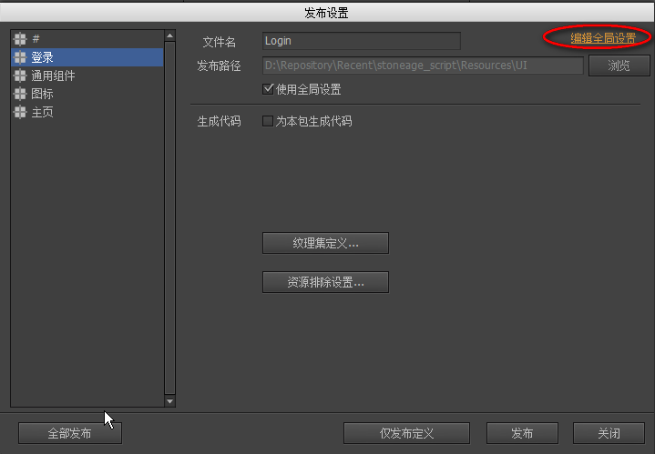
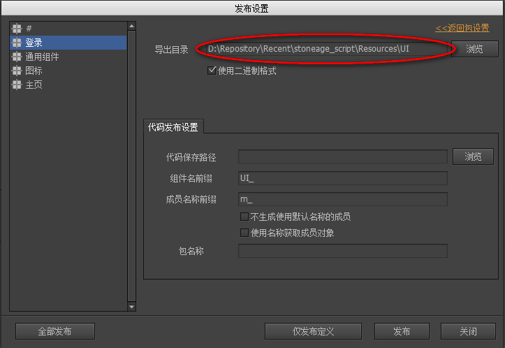

# FairyGUI接口

操作UI的接口，编辑器和相关概念参考<http://www.fairygui.com>

## 编辑器下载地址

<http://res.fairygui.com/FairyGUI-Editor_3_10_3.zip>

## 准备工作

安装游戏使用的字体，目前为思源黑体和本墨金宋，拷贝到**系统文件夹\Fonts**

## 设置导出目录

点击菜单**文件/发布设置**，选择**编辑全局设置**，修改导出目录到自己的脚本资源文件夹(Resources\UI目录)



## 发布UI资源

每次UI有更改，都需要重新发布对应的包

## 脚本引用

需要在脚本中使用接口，需要先引入ui库，如
```
local ui = require "ui"
```

## 全局函数

* create(包名, 组件名) 创建组件
* window(包名, 组件名) 创建窗口
* extension(包名, 组件名) 组件子类化
* hitTest(float, float) 点击测试传入坐标的控件
* hidePopup() 关闭所有弹出

## 常用类

* [Object](Object.md)
* [Component](Component.md)
* [Loader](Loader.md)
* [List](List.md)
* [TextField](TextField.md)
* [TextInput](TextInput.md)
* [Button](Button.md)